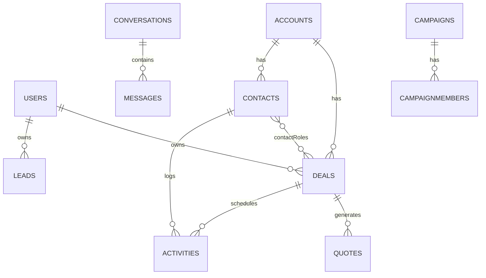

# Core — Universal CRM Data Model

The canonical entities, fields, relationships and lifecycle every CRM shares,
mapped to **org-scoped Firestore**. Verticals extend this; they don't replace
it. Derived from the Salesforce object model and HubSpot/Zoho/Pipedrive
equivalents. [source: https://www.fansfactory.net/blog/understanding-lead-account-contact-opportunity-quote-product-pricebook-order-and-campaign-objects-in-sales-cloud/]

## Table of contents
1. Design principles
2. The entity map & relationships
3. Entity reference (fields)
4. The lead → contact/account → deal lifecycle
5. Pipelines & stages config
6. Activities, conversations & timeline
7. Products, quotes, campaigns
8. Custom fields & extensibility
9. Firestore collection map
10. Denormalization & counters
11. Vertical extension points

---

## 1. Design principles

- **Org-scoped multitenancy**: every business record lives under `orgs/{orgId}/…`
  and carries `orgId`. This is the security and isolation boundary.
- **Universal core + vertical overlay**: the same People→Money→Work→Insight
  spine; verticals add domain objects (Property, Vehicle) and rename "Deal".
- **Denormalize for reads**: Firestore charges per read and can't join. Store
  display fields (e.g., `ownerName`, `stageName`, `contactName`) on the record.
- **Soft references**: store the related id **and** a denormalized snapshot.
- **Auditable & versioned**: mutable records carry `_version`, `createdAt/By`,
  `updatedAt/By`. Sensitive changes also write to `auditLog`.
- **Status as enums**, not free text. Keep enums in `config` so they're editable.
- **Field naming**: English by default. Spanish equivalents (`estado`, `etapa`,
  `valor_estimado`, `motivo_perdida`, `nombre`, `telefono`) are fine for LatAm
  clients — pick ONE convention per project and keep it consistent everywhere
  (rules, indexes, UI). Phones in E.164 (`+573001234567`).

## 2. The entity map & relationships

```
Org (tenant)
 ├─ User (internal: agent/manager/admin)               [1 org → N users]
 ├─ Lead ───(convert)──▶ Contact + Account + Deal       [conversion creates up to 3]
 ├─ Account (company/household)                          [1 account → N contacts, N deals]
 │   └─ Contact (person) ◀── belongs to Account (opt.)   [N contacts ↔ N deals via roles]
 ├─ Deal / Opportunity ── in ──▶ Pipeline → Stage        [1 deal → 1 pipeline/stage]
 │   ├─ contactRoles[] ──▶ Contact                       [M:N deal↔contact]
 │   └─ lineItems[] ──▶ Product                          [quote/CPQ]
 ├─ Activity (task/call/meeting/note/email)              [polymorphic: links to any record]
 ├─ Conversation ─ has ─▶ Message[]                      [omnichannel thread]
 ├─ Product / PriceBook / Quote                          [catalog + quoting]
 ├─ Campaign ─ has ─▶ CampaignMember ──▶ Lead/Contact    [M:N]
 ├─ Automation rule / Config (pipelines, enums, fields)
 └─ AuditLog (immutable)
```

Same core relationships as a Mermaid ER diagram (renders in many viewers):


Relationship types (Salesforce vocabulary, useful even on Firestore):
- **Lookup** = soft FK (store id + snapshot). Most relations.
- **Master-detail** = child can't exist without parent (e.g., Message→Conversation).
- **Junction** = M:N via a join (e.g., `contactRoles` deal↔contact, `CampaignMember`).

## 3. Entity reference (fields)

> `*` = required. All records also have system fields:
> `id, orgId, createdAt, createdBy, createdByName, updatedAt, updatedBy, _version`.

### Org / tenant — `orgs/{orgId}`
`name*, slug, plan, vertical (real_estate|automotive|generic|...), locale (es-CO),
currency (COP), timezone, branding {logo, primaryColor}, settings, billing,
features[], createdAt`.

### User — `orgs/{orgId}/users/{uid}`
`uid*, email*, name*, role* (super_admin|admin|manager|agent|bdc|viewer),
status (active|suspended), photoURL, phone, teamId, managerId,
quota, goals, lastLoginAt, twoFactorEnabled, permissions[] (overrides)`.

### Lead — `orgs/{orgId}/leads/{id}`
`firstName, lastName*, fullName, company, title, email, phone, mobile,
source* (web_form|portal|ads|referral|walk_in|call|whatsapp|import|manual),
sourceDetail, status* (new|working|nurturing|qualified|unqualified|converted),
rating (hot|warm|cold), score (0-100), ownerId*, ownerName, assignedAt,
campaignId, tags[], address {…}, notes, doNotContact (bool),
consent {email, sms, whatsapp, calls, askedAt, source, ip}, lostReason,
convertedTo {contactId, accountId, dealId}, convertedAt,
lastActivityAt, lastContactedAt, customFields {…}`.

### Contact — `orgs/{orgId}/contacts/{id}`
`firstName, lastName*, fullName, email, phone, mobile, accountId, accountName,
title, ownerId*, ownerName, type (buyer|seller|tenant|landlord|customer|…),
address {line, city, state, country, postal}, birthday, tags[], lifecycleStage
(subscriber|lead|sql|customer|evangelist), doNotContact, consent {…},
socials {…}, preferences {…}, lastActivityAt, customFields {…}`.

### Account — `orgs/{orgId}/accounts/{id}` (optional for pure B2C)
`name*, type (business|household|investor), industry, website, phone,
billingAddress {…}, ownerId*, ownerName, parentAccountId, employees, revenue,
tags[], primaryContactId, customFields {…}`.

### Deal / Opportunity — `orgs/{orgId}/deals/{id}`
`name*, accountId, accountName, primaryContactId, primaryContactName,
pipelineId*, stageId*, stageName, status (open|won|lost), amount, currency,
probability (0-100), weightedAmount (amount×prob), expectedCloseDate*,
closedAt, ownerId*, ownerName, source, lostReason, nextStep, lineItems[],
contactRoles [{contactId, role}], lastActivityAt, rotting (days idle),
tags[], customFields {…}`.

### Activity — `orgs/{orgId}/activities/{id}`
`type* (task|call|meeting|email|note|sms|whatsapp), subject*, body,
status (open|completed|cancelled), priority (low|normal|high),
dueAt, completedAt, durationMin, direction (inbound|outbound),
relatedTo* {type (lead|contact|account|deal|property|vehicle), id, name},
ownerId*, ownerName, assignedTo, outcome, reminders[], attachments[]`.

### Conversation — `orgs/{orgId}/conversations/{id}` (+ subcollection `messages`)
`channel* (email|whatsapp|sms|webchat|messenger|instagram), status
(open|pending|resolved|snoozed), subject, contactId, contactName, leadId,
dealId, assignedTo, assignedToName, lastMessage, lastMessageAt,
unreadByAgent, unreadByContact, externalThreadId, tags[]`.
Message — `…/messages/{mid}`: `from (agent|contact|bot|system), authorId,
authorName, text, mediaUrls[], channel, direction, status (sent|delivered|read|
failed), templateId, timestamp, externalId`.

### Product / PriceBook / Quote
Product — `orgs/{orgId}/products/{id}`: `name*, sku, description, category,
unitPrice, currency, cost, taxRate, active, customFields`.
Quote — `orgs/{orgId}/quotes/{id}`: `dealId, contactId, number, status
(draft|sent|accepted|rejected|expired), lineItems [{productId, name, qty,
unitPrice, discount, tax, total}], subtotal, discount, tax, total, validUntil,
terms, pdfUrl, sentAt, acceptedAt, signatureId`.

### Campaign — `orgs/{orgId}/campaigns/{id}` (+ members)
`name*, type (email|ads|event|webinar|social), status (planned|active|done),
startDate, endDate, budget, channel, utm {source, medium, campaign},
metrics {sent, opened, clicked, replied, converted, cost}`.
CampaignMember — `…/members/{id}`: `leadOrContactId, type, status
(sent|opened|clicked|responded|converted)`.

### AuditLog — `orgs/{orgId}/auditLog/{id}` (immutable)
`action (create|update|delete|login|export|consent_change), entityType,
entityId, entityName, actorId, actorName, changes [{field, from, to}],
ip, userAgent, timestamp`.

## 4. The lead → contact/account → deal lifecycle

This is the universal sales motion. A **Lead** is a not-yet-qualified person
tracked separately. On **conversion** it produces, in one step, up to three
records: an **Account**, a **Contact**, and an **Opportunity/Deal**.
[source: https://www.phoneiq.co/blog/understanding-the-difference-between-a-lead-account-contact-and-opportunity-in-salesforce-updated-for-2025]

```
capture → Lead(new)
  → qualify (score/route/work) → Lead(qualified)
    → CONVERT  ──▶ Contact (+ Account)  ──▶ Deal(open) enters Pipeline
                                              → stages… → Deal(won|lost)
```

Implementation: a `convertLead(leadId)` Function that (1) creates/links a
Contact (+ Account), (2) optionally creates a Deal in a chosen pipeline,
(3) stamps `lead.status='converted'` + `convertedTo` + `convertedAt`,
(4) re-points activities/conversations from the lead to the new contact/deal,
(5) writes an audit entry. Idempotent (guard on `convertedTo`).

In verticals the "Deal" is the domain object: real estate buyer/seller
transactions, a dealership vehicle deal. The motion is identical.

## 5. Pipelines & stages config — `orgs/{orgId}/config/pipelines`

Pipelines are **config**, not hard-coded, so each org/vertical defines its own.
```jsonc
{
  "pipelines": [{
    "id": "sales", "name": "Ventas", "default": true, "entity": "deal",
    "stages": [
      { "id": "new",        "name": "Nuevo",        "probability": 10, "order": 1 },
      { "id": "qualified",  "name": "Calificado",   "probability": 25, "order": 2 },
      { "id": "proposal",   "name": "Propuesta",    "probability": 50, "order": 3 },
      { "id": "negotiation","name": "Negociación",  "probability": 75, "order": 4 },
      { "id": "won",        "name": "Ganado",       "probability": 100,"order": 5, "type": "won" },
      { "id": "lost",       "name": "Perdido",      "probability": 0,  "order": 6, "type": "lost" }
    ],
    "rottingDays": 14
  }]
}
```
A deal stores `pipelineId` + `stageId`; `probability` & `weightedAmount` derive
from the stage. Verticals ship multiple pipelines (e.g., buyer + seller).

## 6. Activities, conversations & timeline

- **Activity** is polymorphic via `relatedTo {type,id,name}` so any record gets
  a unified **timeline** (query `activities where relatedTo.id == X order by
  createdAt desc`).
- **Conversation/Message** powers the omnichannel inbox; messages are a
  subcollection for unbounded growth and cheap pagination.
- Both feed `lastActivityAt` / `lastContactedAt` on the parent (denormalized)
  for rotting detection and sorting.

## 7. Products, quotes, campaigns

- Products + PriceBook back **quotes/CPQ**; a quote snapshots line items so
  later price changes don't mutate history.
- Campaigns + members give attribution; `utm` on the lead ties web traffic to
  a campaign. Metrics roll up onto the campaign (denormalized counters).

## 8. Custom fields & extensibility

World-class CRMs let admins add fields without code. Implement a `customFields`
map on each entity **plus** a field-definition registry:
`orgs/{orgId}/config/fields/{entityType}` →
`[{ key, label, type (text|number|date|select|multiselect|bool|currency|
reference), options[], required, group, order, showInList }]`.
The UI renders forms/lists from this registry; rules validate required ones.
This is how one schema serves every vertical and every client.

## 9. Firestore collection map (recommended)

```
orgs/{orgId}                          (tenant doc)
orgs/{orgId}/users/{uid}
orgs/{orgId}/leads/{id}
orgs/{orgId}/contacts/{id}
orgs/{orgId}/accounts/{id}
orgs/{orgId}/deals/{id}
orgs/{orgId}/activities/{id}
orgs/{orgId}/conversations/{id}/messages/{mid}
orgs/{orgId}/products/{id}
orgs/{orgId}/quotes/{id}
orgs/{orgId}/campaigns/{id}/members/{mid}
orgs/{orgId}/auditLog/{id}
orgs/{orgId}/config/{doc}             (pipelines, fields/{entity}, enums, automations, settings)
orgs/{orgId}/counters/{doc}           (sharded aggregates)
-- vertical --
orgs/{orgId}/properties/{id}          (real estate)  + /showings, /transactions
orgs/{orgId}/vehicles/{id}            (dealership)   + /testDrives, /tradeIns, /serviceAppointments
```
Use **collection-group** queries for cross-collection needs (e.g., all messages
assigned to an agent) — but always re-scope by `orgId` in code and rules.

## 10. Denormalization & counters

- Store snapshots (`ownerName`, `stageName`, `contactName`) to avoid joins.
- When a referenced record changes its display name, a Function fans out the
  update (or accept eventual staleness for low-importance fields).
- Aggregates (pipeline totals, counts) use **sharded counters** or scheduled
  rollups; never `count()` large collections on every dashboard load.
- Heavy reporting → mirror events to **BigQuery**, don't scan Firestore.

## 11. Vertical extension points

- **Real estate** (`verticals/real-estate.md`): add `Property` (listing),
  `Showing`, `Transaction`; buyer & seller pipelines; buyer `preferences` on
  Contact for matching.
- **Dealership** (`verticals/automotive-dealership.md`): add `Vehicle`
  (inventory/VIN), `TestDrive`, `TradeIn`, F&I fields on Deal, `ServiceAppointment`.
- **New vertical** (`verticals/_extending-verticals.md`): pick the domain
  object that replaces "Deal", add its entities, define its pipelines, reuse
  everything else (activities, conversations, automation, reporting, RBAC).
